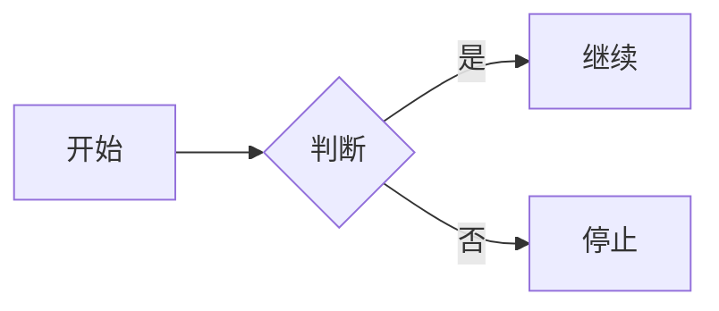
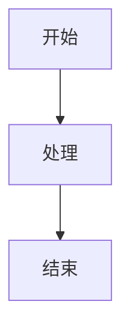

# MoeBlog Jekyll Theme

🌸 一个简洁可爱的二次元萌系 Jekyll 主题，采用粉蓝配色设计。


## ✨ 特性

- 🎨 **粉蓝配色** - 采用 #FFB7D5（嫩粉色）和 #89CFF0（婴儿蓝）的清新配色
- 🌓 **日/夜模式** - 自动检测系统偏好，支持手动切换，状态持久化
- 📱 **响应式设计** - 完美适配桌面端和移动端
- 📑 **自动目录** - 支持 Kramdown 自动生成文章目录
- 🔄 **文章导航** - 自动添加上一篇/下一篇导航
- 📚 **智能归档** - 按年份分组，支持时间排序切换
- 🎭 **Mermaid 支持** - 原生支持 Mermaid 流程图、时序图等
- 🎨 **语法高亮** - 集成 Rouge 语法高亮，自定义粉蓝配色
- 🌸 **可爱元素** - 渐变装饰、圆角设计、动画效果

## 📂 文件结构

```
.
├── _includes/              # 布局组件
│   ├── head.html          # HTML 头部（Meta、CSS、Mermaid）
│   ├── header.html        # 页眉导航
│   ├── footer.html        # 页脚信息
│   └── theme-toggle.html  # 主题切换按钮
├── _layouts/              # 布局模板
│   ├── default.html       # 基础布局
│   ├── home.html          # 首页布局
│   ├── post.html          # 文章布局
│   └── page.html          # 静态页面布局
├── _sass/                 # Sass 样式
│   ├── variables.scss     # 主题变量（颜色、字体）
│   ├── base.scss          # 基础样式（排版、代码块）
│   ├── layout.scss        # 布局样式（导航、文章）
│   └── components.scss    # 组件样式（按钮、标签）
├── assets/
│   ├── css/
│   │   └── style.scss     # 样式入口
│   └── js/
│       └── main.js        # 主题切换脚本
├── pages/                 # 静态页面
│   ├── about.md           # 关于页面
│   └── archive.md         # 归档页面（带排序）
├── _posts/                # 博客文章
├── _config.yml            # Jekyll 配置
├── Gemfile                # Ruby 依赖
└── .gitignore            # Git 忽略文件
```

## 🚀 快速开始

### 1. 安装依赖

确保已安装 Ruby 2.5+ 和 Bundler：

```bash
gem install bundler
bundle install
```

### 2. 配置主题

在 `_config.yml` 中添加以下配置：

```yaml
# 基本信息
url: "https://yourdomain.com"
title: "你的博客名称"
description: "博客描述"
author: "你的名字"

# 主题设置
timezone: Asia/Shanghai
permalink: /:year/:month/:day/:title/

# 构建设置
markdown: kramdown
plugins:
  - jekyll-sitemap
  - jekyll-feed
  - jekyll-paginate

# Kramdown 设置（支持 TOC）
kramdown:
  input: GFM
  syntax_highlighter: rouge
  syntax_highlighter_opts:
    css: class
  auto_ids: true
  toc_levels: 1..6
  entity_output: as_char

# 分页（归档页面）
paginate: 5
paginate_path: /archive/page:num/

# 社交链接（可选）
github: yourusername
```

### 3. 创建文章

文章需放在 `_posts/` 目录，命名格式为 `YYYY-MM-DD-title.md`：

```markdown
---
layout: post
title: "文章标题"
date: 2025-01-01
toc: true  # 启用目录
categories: [分类]
tags: [标签]
---

文章内容...

## 第一节

内容...

### 子节

更多内容...
```

## 🎨 主题配色

### 浅色模式（默认）

| 元素 | 颜色代码 | 说明 |
|------|---------|------|
| 主色 | `#FFB7D5` | 嫩粉色 |
| 辅色 | `#89CFF0` | 婴儿蓝 |
| 背景 | `#FDF5F7` | 极淡粉色 |
| 文字 | `#4A4458` | 紫灰色 |

### 深色模式

| 元素 | 颜色代码 | 说明 |
|------|---------|------|
| 主色 | `#FFB7D5` | 嫩粉色 |
| 辅色 | `#89CFF0` | 婴儿蓝 |
| 背景 | `#1e1e30` | 深蓝紫色 |
| 文字 | `#F0F0F0` | 浅灰色 |

## ⚙️ 功能配置

### 启用文章目录

在文章 front matter 中添加 `toc: true`：

```yaml
---
layout: post
title: "带目录的文章"
toc: true
---
```

或在文章开头添加：

```markdown
* 目录会自动生成
{:toc}
```

### Mermaid 图表

主题已集成 Mermaid.js，直接使用代码块即可：

````markdown

````

### 归档排序

归档页面支持两种排序：
- 时间最新（默认）
- 时间最旧

通过下拉选择框切换，使用 JavaScript 动态渲染。

## 🎯 自定义

### 修改配色

编辑 `_sass/variables.scss`：

```scss
// 浅色模式
$light-primary: #FFB7D5;      // 修改粉色
$light-accent: #89CFF0;       // 修改蓝色

// 深色模式
$dark-primary: #FFB7D5;
$dark-accent: #89CFF0;
```

### 添加页面

创建 `pages/custom.md`：

```markdown
---
layout: page
title: 自定义页面
permalink: /custom/
---

页面内容...
```

### 自定义导航

编辑 `_includes/header.html`：

```html
<nav class="site-nav">
  <a href="{{ '/' | relative_url }}">首页</a>
  <a href="{{ '/archive/' | relative_url }}">归档</a>
  <a href="{{ '/custom/' | relative_url }}">自定义</a>
  <!-- 添加更多链接 -->
</nav>
```

## 📦 依赖

- **Jekyll** 4.0+
- **jekyll-sitemap** - 站点地图生成
- **jekyll-feed** - RSS 订阅
- **jekyll-paginate** - 分页功能
- **kramdown** - Markdown 解析器
- **rouge** - 语法高亮
- **Mermaid.js** 10+ - 图表渲染（CDN）

## 🌐 部署

### GitHub Pages

1. 推送代码到 GitHub
2. 在仓库设置中启用 GitHub Pages
3. 选择分支和目录
4. 等待构建完成

### 本地预览

```bash
bundle exec jekyll serve
# 访问 http://127.0.0.1:4000
```

## 📝 文章格式示例

### 基本文章

```markdown
---
layout: post
title: "我的第一篇文章"
date: 2025-01-01
categories: [教程]
tags: [Jekyll, 博客]
---

这是文章内容...

## 章节标题

内容...

### 子章节

更多内容...
```

### 带 TOC 的文章

```markdown
---
layout: post
title: "长文章标题"
date: 2025-01-01
toc: true
---

* 目录自动生成
{:toc}

## 第一章

内容...

## 第二章

内容...
```

### 带 Mermaid 图表

```markdown
---
layout: post
title: "流程图示例"
---


````

## 🤝 贡献

欢迎提交 Issue 和 Pull Request！

1. Fork 本仓库
2. 创建特性分支 (`git checkout -b feature/AmazingFeature`)
3. 提交更改 (`git commit -m 'Add some AmazingFeature'`)
4. 推送到分支 (`git push origin feature/AmazingFeature`)
5. 开启 Pull Request

## 📄 许可证

本项目采用 MIT 许可证 - 查看 [LICENSE](LICENSE) 文件了解详情。

## 🙏 致谢

- [Jekyll](https://jekyllrb.com/) - 静态网站生成器
- [Mermaid.js](https://mermaid.js.org/) - 图表库
- [Rouge](https://github.com/rouge-ruby/rouge) - 语法高亮器

## 📮 联系方式

- 项目主页: [GitHub Repository](https://github.com/greenhandzdl/blog.site)
- 问题反馈: [Issues](https://github.com/greenhandzdl/blog.site/issues)

---

用 💖 和 ☕ 制作 | MoeBlog Theme ✿