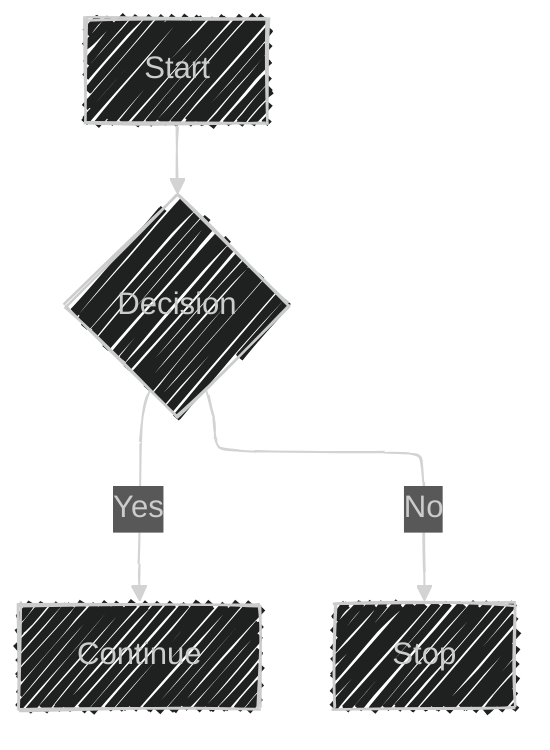

# 拥抱Mermaid

## 缘起

之前有段时间,很痴迷于UML并且一直尝试用着**PlentUML**.但是,实际上**PlentUML**的编译器一点都不友好!!!所以,在大致的写下后,大部分时间都在尝试让编译器能够输出我想要的图像.

GPT的输出大部分是**mermaid**代码,于是对**Mermaid**开始感兴趣起来.得益于**Typora**对mermaid的支持,我对Mermaid开始有些心得,这篇文章大致涉及一些代码,但并不多,希望读者可以自行寻找文档进行查看,这篇文章仅仅介绍大概.

图表支持:

>
>
>流程图
>
>时序图
>
>类图
>
>状态图
>
>实体关系图
>
>用户旅程图
>
>甘特图
>
>饼图
>
>象限图
>
>需求图
>
>Gitgraph (Git) 
>
>C4
>
>思维导图
>
>时间线图
>
>ZenUML
>
>桑基图
>
>XY 图
>
>框图
>
>数据包图
>
>看板图
>
>架构图
>
>雷达图

## 语法

### [个性外观配置](https://mermaid.nodejs.cn/intro/syntax-reference.html#selecting-diagram-looks)

###  图表语法

#### [流程图](https://mermaid.nodejs.cn/syntax/flowchart.html)

### [时序图](https://mermaid.nodejs.cn/syntax/sequenceDiagram.html)

#### 类图

#### [状态图](https://mermaid.nodejs.cn/syntax/stateDiagram.html)

#### [实体图](https://mermaid.nodejs.cn/syntax/entityRelationshipDiagram.html)

#### [旅程图](https://mermaid.nodejs.cn/syntax/userJourney.html)

#### [甘特图](https://mermaid.nodejs.cn/syntax/gantt.html)

#### [饼图](https://mermaid.nodejs.cn/syntax/pie.html)

#### [象限图](https://mermaid.nodejs.cn/syntax/quadrantChart.html)

#### [需求图](https://mermaid.nodejs.cn/syntax/requirementDiagram.html)

#### [Git图](https://mermaid.nodejs.cn/syntax/gitgraph.html)

#### [C4](https://mermaid.nodejs.cn/syntax/c4.html)

#### [思维导图](https://mermaid.nodejs.cn/syntax/mindmap.html)

#### [时间线图](https://mermaid.nodejs.cn/syntax/timeline.html)

#### [时序图 zenUML](https://mermaid.nodejs.cn/syntax/zenuml.html)

#### [桑基图](https://mermaid.nodejs.cn/syntax/sankey.html)

#### [XY图](XY 图)

#### [框图](https://mermaid.nodejs.cn/syntax/block.html)

#### [数据包图](https://mermaid.nodejs.cn/syntax/packet.html)

#### [看板图](https://mermaid.nodejs.cn/syntax/kanban.html)

#### [架构图](https://mermaid.nodejs.cn/syntax/architecture.html)

####  [雷达图](https://mermaid.nodejs.cn/syntax/radar.html)
