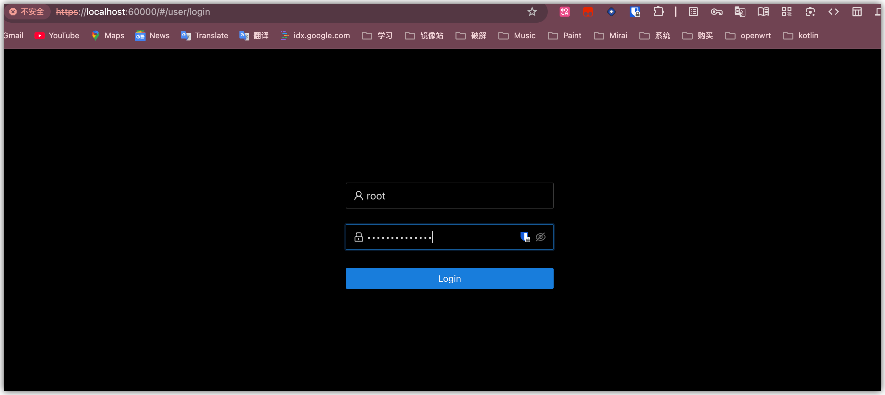

# Mac上部署Viper

> [!NOTE]
>
> 这里采用OrbStack而不是Docker软件.

> [!TIP]
>
> 如果你是Arch用户,你或许可以采用这个[aur包](https://aur.archlinux.org/packages/viper-bin)

>参考:
>
>[官网文档](https://www.viperrtp.com/guide/getting_start)
>
>[某个前人留下参考](https://gui-ying233.github.io/Nest/Viper%20on%20macOS)

## 安装

* 省略**OrbStack**安装
* 某个配置文件参考(docker按照自己的来):

```zsh
~ took 13s 
❯ cat ~/.docker/config.json
{
	"auths": {},
	"credsStore": "osxkeychain",
	"currentContext": "orbstack"
}%   
```

* 提升当前用户的文件描述符（File Descriptor）上限**

```zsh
❯ sudo ulimit -n 65535
Password:

```

* 设置**viper**目录

```zsh
export VIPER_DIR=~/VIPER
mkdir -p $VIPER_DIR && cd $VIPER_DIR
```

* 生成**docker-compose**文件(或许:[更优雅配置](https://www.viperrtp.com/guide/issues))

  > [!TIP]
  >
  > 或许你可以提前的替换command下密码内容.

  

```zsh
tee docker-compose.yml <<-'EOF'
services:
  viper:
    image: viperplatform/viper:latest
    container_name: viper-c
    network_mode: "host"
    restart: always
    volumes:
      - ${PWD}/loot:/root/.msf4/loot
      - ${PWD}/db:/root/viper/Docker/db
      - ${PWD}/module:/root/viper/Docker/module
      - ${PWD}/log:/root/viper/Docker/log
      - ${PWD}/nginxconfig:/root/viper/Docker/nginxconfig
      - ${PWD}/elasticsearch:/var/lib/elasticsearch
    ulimits:
      nofile:
        soft: 65534
        hard: 65534
      nproc:
        soft: 65534
        hard: 65534
    command: ["VIPER_PASSWORD"]
EOF
```

* 设置安装密码

  ```zsh
  export VIPER_PASSWORD=yourpassword
  # 注意:下面这个替换有些问题,可能是GNU软件sed特有行为,所以建议按照上面提示进行替换
  sed -i "s/VIPER_PASSWORD/$VIPER_PASSWORD/g" docker-compose.yml
  ```

  

* 启动

  > [!TIP]
  >
  > OrbStack的docker相关配置(换源):
  >
  > ```zsh
  > ~ 
  > ❯ cat  ~/.orbstack/config/docker.json   
  > {
  >     "registry-mirrors": [
  >         "https://docker.xuanyuan.me"
  >     ]
  > }        
  > ```

```zsh
docker compose up -d
```

通过 [Localhost](https://localhost:60000/) 进入登陆页面,**用户名**root,**密码**你之前设置的.



* 完成


## 补充配置:

* Anti-Tracking:https://www.viperrtp.com/guide/avoid_tracing

* AI Agent:

  本地Ollama配置地址**http://host.docker.internal:11434/v1**
