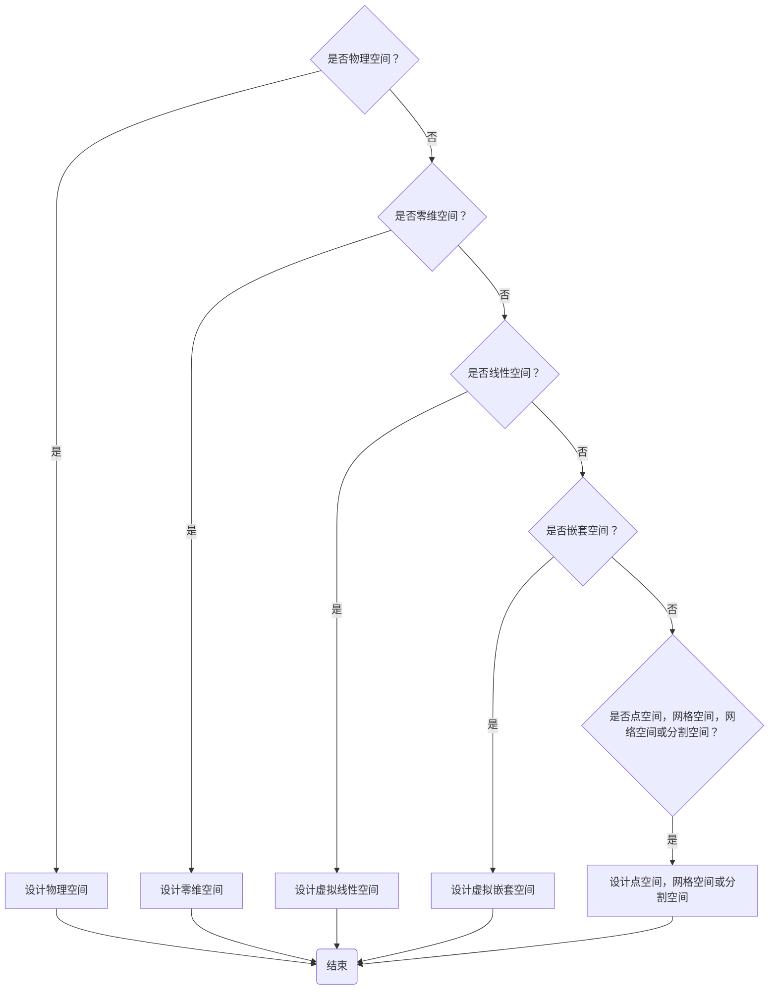

# 七步游戏化法


[TOC]

> 推荐PROMPT:

## 首要情感

* 


## 游戏化目标


|                      | 乐趣类型                   |                            |                            |                          |
| -------------------- | -------------------------- | -------------------------- | -------------------------- | ------------------------ |
| **玩家类型**         | 严肃的乐趣：赋予意义与价值 | 困难的乐趣：掌握知识与技能 | 简单的乐趣：驱动创意与想象 | 社交的乐趣：建构社交链接 |
| 战斗者行为一玩家     |                            |                            |                            |                          |
| 成就者行为一游戏世界 |                            |                            |                            |                          |
| 社交者互动一玩家     |                            |                            |                            |                          |
| 探索者互动一游戏世界 |                            |                            |                            |                          |

 

## 游戏类型


|                   | 类型 |      |      |      |          |      |      |      |
| ----------------- | ---- | ---- | ---- | ---- | -------- | ---- | ---- | ---- |
| **平台**          | 动作 | 冒险 | 探索 | 解谜 | 角色扮演 | 模拟 | 体育 | 策略 |
| 实体世界          |      |      |      |      |          |      |      |      |
| 桌面游戏          |      |      |      |      |          |      |      |      |
| 问答/小测验       |      |      |      |      |          |      |      |      |
| 街机游戏          |      |      |      |      |          |      |      |      |
| 主机              |      |      |      |      |          |      |      |      |
| 在线游戏          |      |      |      |      |          |      |      |      |
| 电脑（PC）游戏    |      |      |      |      |          |      |      |      |
| 增强现实/虚拟现实 |      |      |      |      |          |      |      |      |


## 游戏玩法


| 挑战     | 在完成游戏化学习后，玩家应该能够……                 |
| -------- | -------------------------------------------------- |
| 记忆     | 回忆起在游戏中看到或听到的事物。                   |
| 知识     | 应用基于事实的信息的知识。                         |
| 概念推理 | 使用推理技能和特定学科的外部知识解决问题。         |
| 形式逻辑 | 在任何回合制游戏中应用战略思维。                   |
| 横向思维 | 使用曲解的推理技能解决问题，即跳出框框思考。       |
| 经济     | 积累资源，在经济中取得平衡或照顾生物。             |
| 冲突     | 通过策略、战术、后勤或隐身直接击败对手。           |
| 身体协调 | 应用身体能力，最常见的是手眼协调。                 |
| 时间压力 | 在别人完成之前完成某事。                           |
| 探索     | 在进入新区域时使用空间意识，看到新事物并克服障碍。 |
| 模式识别 | 识别视觉或听觉模式/变化和行为模式。                |


| 规则 | 规则功能                               | C1   | C2   | C3   | C4   | C5   | C6   |
| ---- | -------------------------------------- | ---- | ---- | ---- | ---- | ---- | ---- |
| R1   | 描述玩家为了实现游戏目标必须做什么     |      |      |      |      |      |      |
| R2   | 描述玩家在尝试实现游戏目标时不能做什么 |      |      |      |      |      |      |
| R3   | 描述游戏中如何开始一个游戏回合         |      |      |      |      |      |      |
| R4   | 描述游戏中如何结束一个游戏回合         |      |      |      |      |      |      |
| R5   | 描述什么条件下玩家会赢或输掉游戏       |      |      |      |      |      |      |


##  互动模型和社交互动模式


| 互动模型                              | 基于头像 | 多元存在 | 基于派对 | 基于竞技者 | 桌面 |
| ------------------------------------- | -------- | -------- | -------- | ---------- | ---- |
| 单人游戏 (我 vs 情境)                 |          |          |          |            |      |
| 双人竞争 （你 vs 我）                 |          |          |          |            |      |
| 多人竞争 （每个人为自己）             |          |          |          |            |      |
| 多人合作 （我们大家一起）             |          |          |          |            |      |
| 配对或团队基础 （我们 vs 他们）       |          |          |          |            |      |
| 混合竞争 （竞争但允许在某些时候合作） |          |          |          |            |      |


## 游戏空间





## 游戏故事

```markdown
第一幕：设置

• 催化剂

第二幕：对抗

• 第一转折点 

• 第二转折点 

• 第三转折点 

• 高潮

第三幕：解决

* 最终解决
```

