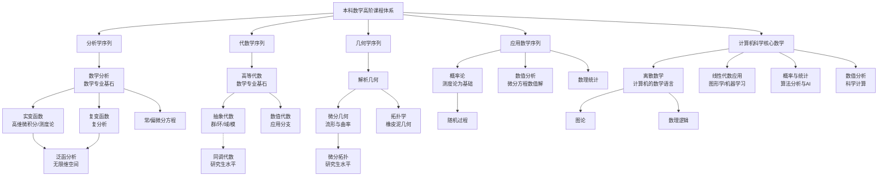

Todo-list: 
- [x] [数学分析  陈纪修](https://www.bilibili.com/video/BV15v411g7VP)
- [ ] [高等代数 丘维声](https://www.bilibili.com/video/BV1jR4y1M78W)
- [ ] 解析几何
- [ ] 实变函数
- [ ] 复变函数
- [ ] 泛函分析
- [ ] 常/偏微分方程
- [x] 概率与统计
  - [ ] 测度论 
  - [ ] 博弈论
- [ ] 数值分析
- [ ] 数理统计
- [x] 离散数学
  - [ ] 数理逻辑
  - [ ] 图论 
- [ ] 抽象代数/近世代数
  - [ ] 同调代数
- [ ] 微分几何
- [ ] 拓扑学
